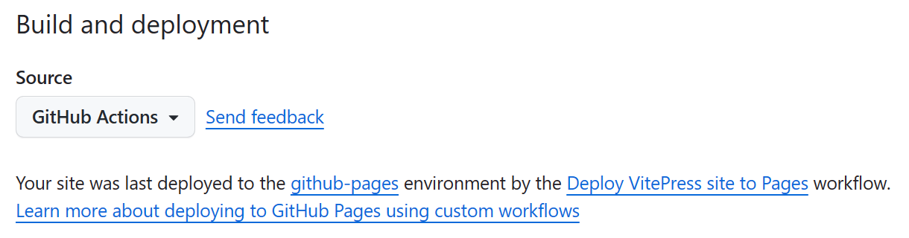
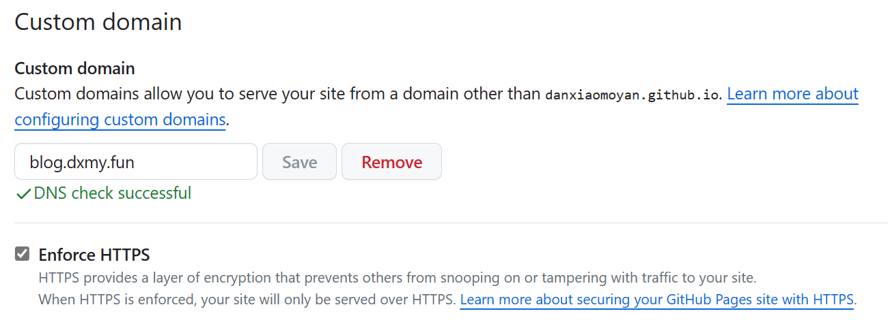
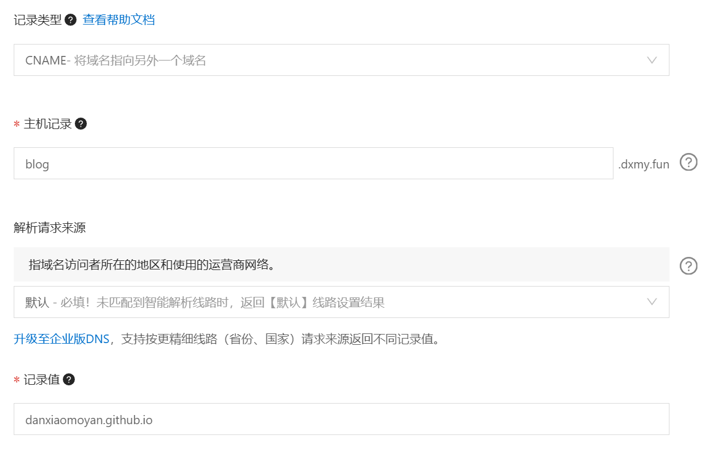

# VitePress 建站记录

平时浏览网页时，发现很多网站都是基于 [VitePress](https://vitepress.dev/) 搭建的，正好目前 VitePress 也即将发布 1.0
正式版，基本不会再有大的变动，于是决定选用 VitePress 整个博客玩玩

这里记录着建站过程中的一些配置和优化过程

## 界面优化

### VitePress 配置

VitePress 内的各个元素默认英文显示，首先先进行一些本地化配置：

::: code-group

```ts [页面元素配置]
// .vitepress/config.mts
export default defineConfig({
  themeConfig: {
    outline: {
      label: '章节速览'
    },
    lastUpdated: {
      text: '最后编辑'
    },
    docFooter: {
      prev: '上一篇',
      next: '下一篇'
    },
    darkModeSwitchLabel: '外观',
    sidebarMenuLabel: '菜单',
    returnToTopLabel: '返回顶部'
  }
})
```

```ts [搜索弹窗配置]
// .vitepress/config.mts
export default defineConfig({
  themeConfig: {
    // 搜索
    search: {
      provider: 'local',
      options: {
        locales: {
          root: {
            translations: { // [!code focus:15]
              button: {
                buttonText: '在莫记中搜索'
              },
              modal: {
                displayDetails: '显示详细列表',
                resetButtonTitle: '清除查询条件',
                noResultsText: '未找到相关结果',
                footer: {
                  navigateText: '切换',
                  selectText: '选择',
                  closeText: '关闭'
                }
              }
            }
          }
        }
      }
    }
  }
})
```

:::

### 更换默认字体

VitePress 默认提供的字体看着不太习惯，于是想换成平时 IDE 内设置的字体：中文 `HarmonyOS Sans SC`，代码 `JetBrains Mono`

文档内也提供了更换默认主题下字体的方式：

```ts
// .vitepress/theme/index.ts
import DefaultTheme from 'vitepress/theme-without-fonts'
import './custom.css'

export default DefaultTheme
```

```css
/* .vitepress/theme/custom.css */
@font-face {
    font-family: 'HarmonyOS Sans SC';
    src: url('font/HarmonyOS_Sans_SC_Regular.woff2') format('woff2');
    font-weight: 400;
}

@font-face {
    font-family: 'HarmonyOS Sans SC';
    src: url('font/HarmonyOS_Sans_SC_Medium.woff2') format('woff2');
    font-weight: 500;
}

@font-face {
    font-family: 'HarmonyOS Sans SC';
    src: url('font/HarmonyOS_Sans_SC_Bold.woff2') format('woff2');
    font-weight: 600;
}

@font-face {
    font-family: 'JetBrains Mono';
    src: url('font/JetBrainsMono_Regular.woff2') format('woff2');
    font-weight: 400;
}

:root {
    /* 字体 */
    --vp-font-family-base: 'HarmonyOS Sans SC';
    --vp-font-family-mono: 'JetBrains Mono', 'HarmonyOS Sans SC';

    /* 其他样式 */
}
```

::: tip 为什么字体的 CSS 配置会是上面这样呢？

- 如果仅仅更改 `--vp-font-family-base`，自己的设备由于安装了这些字体，确实能正确替换，但是别人打开网站就会回滚到默认字体
- 使用 `@font-face` 引用字体文件，构建时将这些字体打包到资源路径下，才能在任何地方都显示这些字体
- 查看 CSS 后，发现引用到的 `font-weight` 只有 400、500、600、700 这几个值，于是提供了 HarmonyOS Sans SC 的三种字重

:::

::: details 关于字体的题外话

由于 HarmonyOS Sans SC 提供的字符数量太多，导致字体文件过大，仅一个字重的 `.ttf` 字体文件就占到了 8 MB，网站为了显示几 KB
的文本内容就需要加载 24 MB 的字体文件，显然不太合适，于是对这几个字体文件进行了压缩，需要的伙伴可以去仓库自取

**下面是简略的压缩流程：**

1. 提取出基本拉丁字符、中文标点符号、通用规范汉字表常用字集 3500 字的 Unicode 编码（压缩后仅 96+29+3500=3625 个字符，却能完全满足需求）
2. 安装 Python 的 `fonttools` 库，执行 `pyftsubset xxx.ttf --unicodes-file=unicode.txt` 命令，作用是使用指定文件内的
   Unicode 编码压缩指定的字体
3. 将 `.ttf` 格式的字体转换为 `.woff2` 格式（woff2 格式实现了更高的压缩率和更好的性能，是目前最适合应用在网站上的字体格式）

如果追求极致的话，还可以对字体进行分片操作，切分成多个包含不同字符集的小文件，然后访问时按需加载

> 附：常用字集 3500 字一览，给你一点小小的方块字震撼
>
> 

:::

## 易用性优化

### 自动生成侧边栏

VitePress 中的侧边栏配置是直接写在 `config.mts` 内的，确保了内容的正确性，但也牺牲了便利性

于是手动实现了自动生成侧边栏的功能，这样添加了 Markdown 文件后侧边栏就能自动更新

```ts
// .vitepress/utils/genSidebar.mts

/**
 * 根据文件路径生成页面链接
 */
function generateLink(filePath: string, basePath: string): string {
  return '/' + path.relative(basePath, filePath)
    .replace(/\\/g, '/')
    .replace(/\.md$/, '')
}

/**
 * 递归遍历目录生成侧边栏项
 */
function generateSidebarItems(directory: string, basePath: string): SidebarInfo {
  // 侧边栏项
  const sidebarItems: DefaultTheme.SidebarItem[] = []
  // 该目录是否可点击
  let folderLink = fs.existsSync(path.join(directory, 'index.md'))
    ? generateLink(directory, basePath) + '/'
    : null

  const filesAndDirs = fs.readdirSync(directory, { withFileTypes: true })
  filesAndDirs.forEach(dirent => {
    const fullPath = path.join(directory, dirent.name)
    if (dirent.isDirectory()) {
      // 如果是目录则递归调用
      const directoryItems = generateSidebarItems(fullPath, basePath)
      if (directoryItems.sidebarItems.length > 0) {
        sidebarItems.push({
          text: dirent.name,
          ...(directoryItems.folderLink ? { link: directoryItems.folderLink } : {}),
          items: directoryItems.sidebarItems
        })
      }
    } else if (path.extname(dirent.name) === '.md' && dirent.name !== 'index.md') {
      // 如果是 Markdown 文件则添加到数组
      sidebarItems.push({
        text: path.basename(dirent.name, '.md'),
        link: generateLink(fullPath, basePath)
      })
    }
  })

  return { sidebarItems, folderLink }
}

/**
 * 为指定目录生成侧边栏
 */
export function generateSidebar(directory: string): DefaultTheme.SidebarItem[] {
  let basePath = path.dirname(directory)
  return generateSidebarItems(directory, basePath).sidebarItems
}
```

### 实现图片预览

由于 VitePress 中的图片无任何附加功能，导致一些细节较多的图片无法方便的预览，为方便后续的使用，这里参照
[Issues](https://github.com/vuejs/vitepress/issues/854) 内的方式实现了图片点击预览的效果

安装 [medium-zoom](https://github.com/francoischalifour/medium-zoom)，这是一个轻量级的用于实现图片预览效果的 JavaScript 库

```sh
pnpm add -D vue
pnpm add -D medium-zoom
```

扩展默认主题，在页面加载或路由变化的时候初始化 `mediumZoom`，使其应用到 `.main img`，也就是文档中的所有图片

```ts
export default {
  extends: DefaultTheme,
  setup() {
    const route = useRoute()
    const initZoom = () => mediumZoom('.main img', {
      background: 'var(--vp-c-gray-soft)',
      margin: 24
    })
    onMounted(() => initZoom())
    watch(
      () => route.path,
      () => nextTick(() => initZoom()))
  }
}
```

然后在 CSS 文件中为下面两个类添加 `z-index` 属性，目的是在图片放大时，背景遮罩和图像自身能够完全覆盖导航栏等页面元素

```css
.medium-zoom-image {
    z-index: 30;
}

.medium-zoom-overlay {
    z-index: 30;
}
```


## 网站部署

既然做博客，就要专注内容，不能被杂七杂八的事情分散精力，所以选择了 GitHub Pages

### GitHub Pages

VitePress 文档中也贴心的附上了 GitHub Actions 工作流的配置

复制过来后翻译了部分注释，然后将包管理器更换为 pnpm 后，最终配置如下：

```yml
# .github/workflows/deploy.yml
name: Deploy VitePress site to Pages

# 推送到 main 分支或手动触发时执行
on:
  push:
    branches: [ main ]
  workflow_dispatch:

# 设置 GITHUB_TOKEN 的权限以允许部署到 GitHub Pages
permissions:
  contents: read
  pages: write
  id-token: write

# 只允许一个并发部署, 并跳过多余的部署任务
concurrency:
  group: pages
  cancel-in-progress: false

jobs:
  # 构建任务
  build:
    runs-on: ubuntu-latest
    steps:
      - name: Checkout
        uses: actions/checkout@v3
        with:
          fetch-depth: 0
      - name: Setup pnpm
        uses: pnpm/action-setup@v2
        with:
          version: 8.x
      - name: Setup Node
        uses: actions/setup-node@v3
        with:
          node-version: 20
          cache: pnpm
      - name: Setup Pages
        uses: actions/configure-pages@v3
      - name: Install dependencies
        run: pnpm install
      - name: Build with VitePress
        run: |
          pnpm docs:build
          touch .vitepress/dist/.nojekyll
      - name: Upload artifact
        uses: actions/upload-pages-artifact@v2
        with:
          path: .vitepress/dist

  # 部署任务
  deploy:
    environment:
      name: github-pages
      url: ${{ steps.deployment.outputs.page_url }}
    needs: build
    runs-on: ubuntu-latest
    name: Deploy
    steps:
      - name: Deploy to GitHub Pages
        id: deployment
        uses: actions/deploy-pages@v2
```

然后将仓库 Pages 设置中的部署构建源修改为 `GitHub Actions`



### 自定义域名

然后继续设置自定义域名，将原本 `username.github.io` 的域名修改为自己的域名



修改自己域名的 DNS 解析，添加 `CNAME` 记录，值为原 GitHub Pages 域名 `username.github.io`



配置完成后，等待几分钟，GitHub Pages 验证自定义域名的 DNS 即可成功，并该域名提供 HTTPS 安全证书
