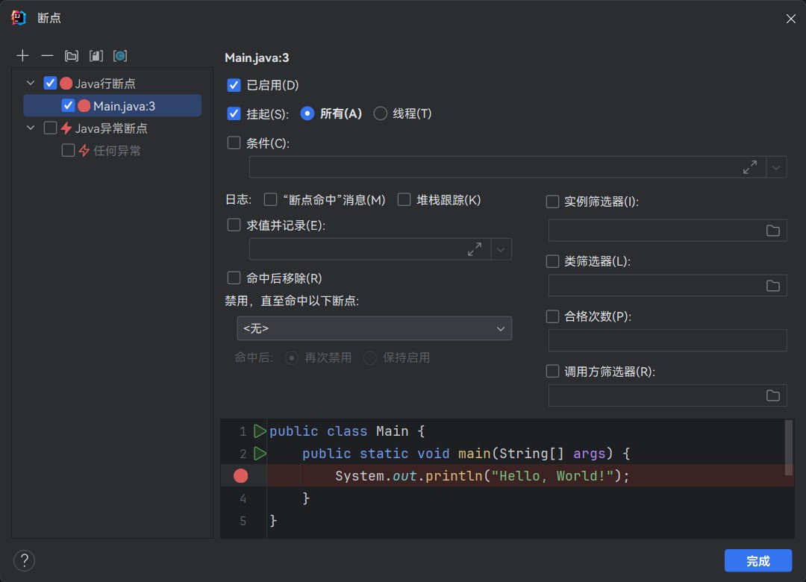

# IDEA Debug 操作

## 「断点类型」

- **行断点:** 到达设置断点的代码行时暂停
- **方法断点:** 进入或退出设置断点的方法时暂停 *(支持通配符匹配)*
- **字段观察断点:** 获取或更新设置断点的字段时暂停
- **异常断点:** 抛出设置断点或其子类的异常时暂停

## 「断点管理」

- **创建普通断点:** <kbd>单击行号</kbd>
- **创建临时断点:** <kbd>Alt + 单击行号</kbd>
- **创建详细断点:** <kbd>Shift + 单击行号</kbd>
- **启用或禁用断点:** <kbd>Alt + 单击断点</kbd>
- **移动断点:** <kbd>右键拖拽断点</kbd>
- **复制断点:** <kbd>Ctrl + 右键拖拽断点</kbd>
- **忽略断点:** 将所有断点暂时禁用

## 「断点属性」

### 『通用属性』

- **挂起:** 设置断点命中时是否暂停程序执行
    - **所有:** 断点命中时暂停所有线程的执行
    - **线程:** 断点命中时暂停当前线程的执行
- **条件:** 设置触发断点所需要的条件
- **日志:** 当断点命中时打印日志
    - **命中消息:** 打印 `到达 Test.test(Test.java:xxx) 的断点` 格式的消息
    - **堆栈追踪:** 打印断点命中时的堆栈追踪信息
    - **求值并记录:** 断点命中时计算表达式并打印结果
- **命中后移除:** 当断点命中后自动删除该断点
- **禁用直至命中:** 当指定的断点命中后再启用自身
- **合格次数:** 断点每触发达到一定次数后再进行命中
- **筛选器:**
    - **实例筛选器:** 通过设置实例 ID 实现只对特定实例生效
    - **类筛选器:** 通过设置类名实现只对特定类生效
    - **调用方筛选器:** 根据方法的调用方设置断点是否生效

## 「调试操作」

- **单步跳出代码块:** 运行到当前代码块结束
- **运行到光标处:** 运行到光标所在位置
- **强制返回:** 强制使当前方法返回一个给定的值
- **抛出异常:** 强制使当前方法抛出一个给定的异常
- **重置栈帧:** 回退到当前调用方法先前的栈帧中
- **计算表达式:** 通过表达式获取或更改变量的值
- **添加监视:** 实时监控表达式或特定变量的值
