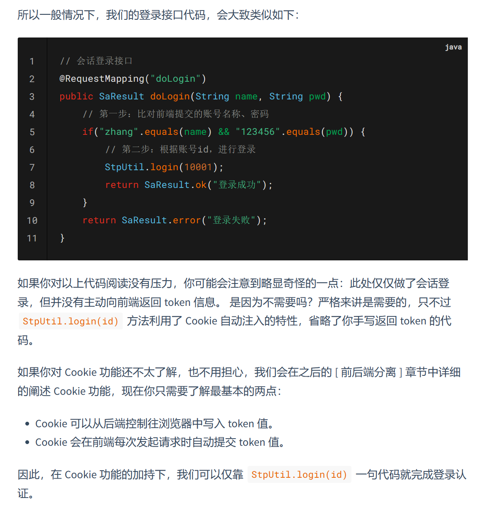
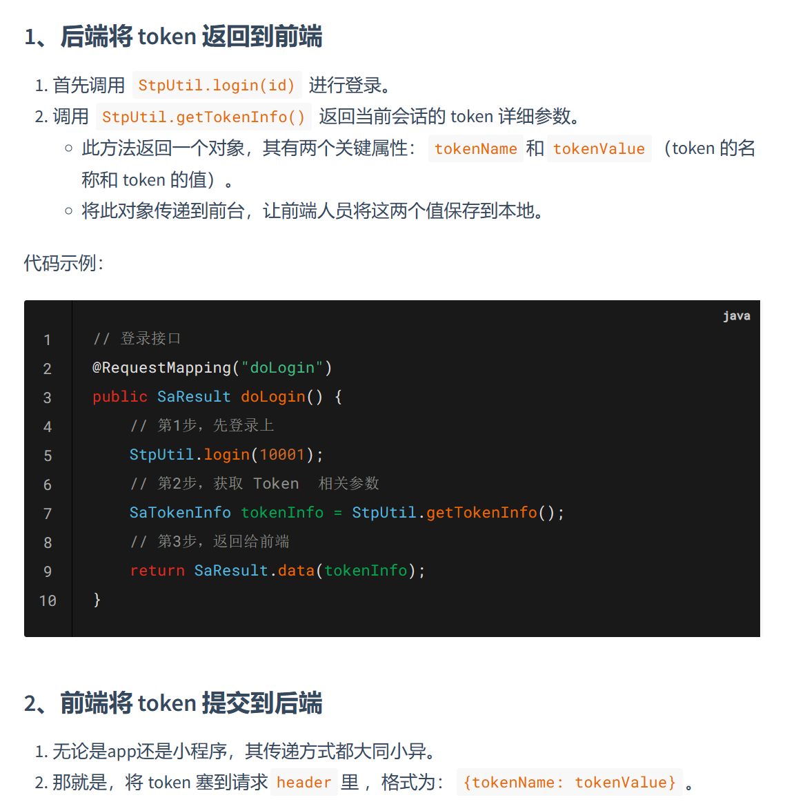
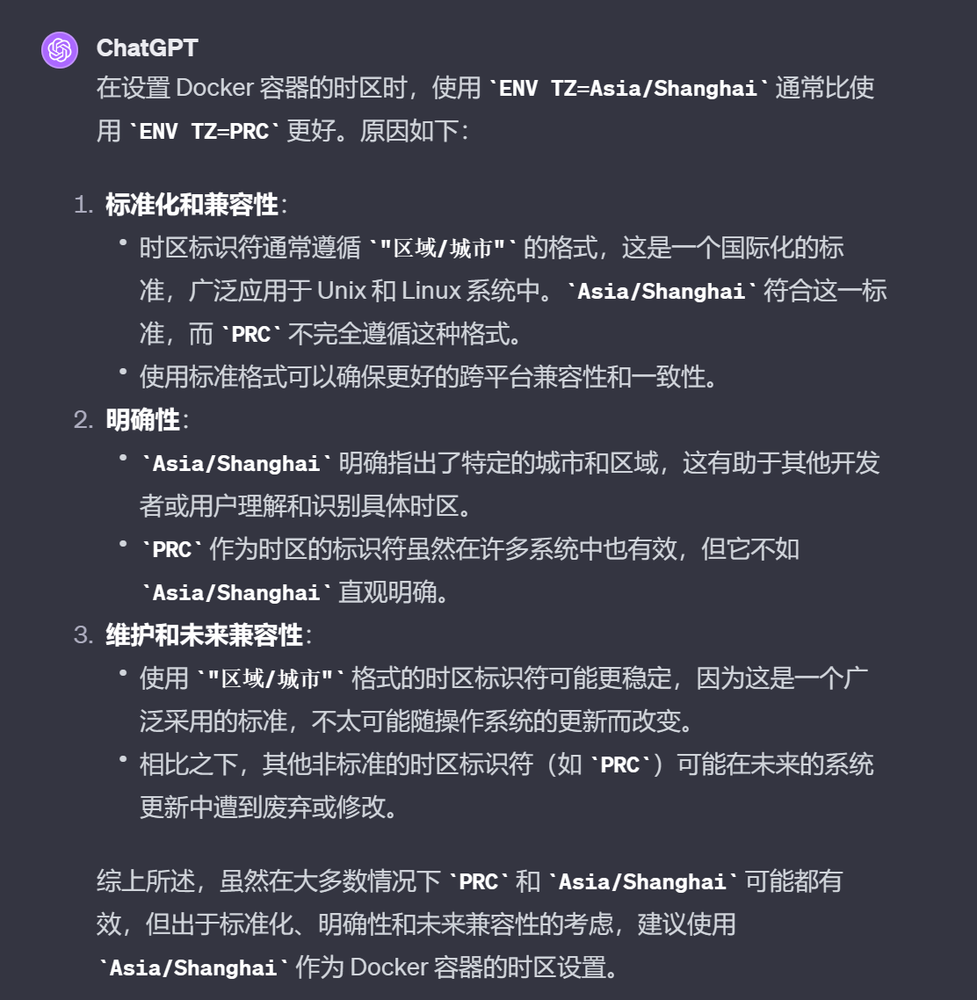
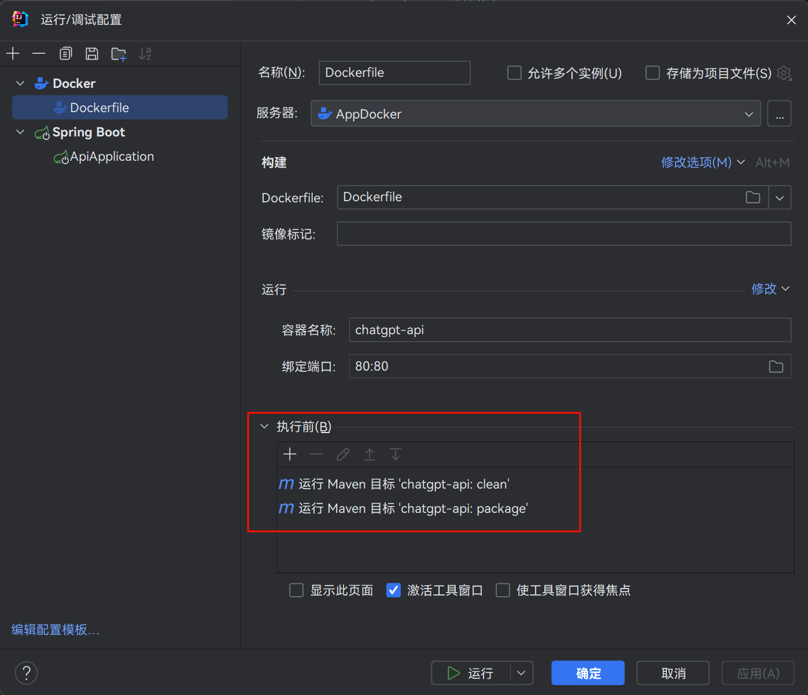

# OpenAI 项目学习笔记 - 前 7 节

## 「4. Nginx环境配置」

启动容器时我没有使用给容器设置端口映射 `-p 80:80 -p 443:443` 的方式

而是设置了容器的网络模式 `network=host`, 容器共享主机的网络命名空间, 方便配置文件内直接写 `localhost:xxxx` 就能访问到其他容器

```shell
docker run \
    --name Nginx \
    --network=host \
    --restart=always \
    -v /data/nginx/html:/usr/share/nginx/html \
    -v /data/nginx/conf/nginx.conf:/etc/nginx/nginx.conf \
    -v /data/nginx/conf/conf.d:/etc/nginx/conf.d \
    -v /data/nginx/ssl:/etc/nginx/ssl \
    -v /data/nginx/logs:/var/log/nginx \
    -d nginx
```

## 「6. Shiro登录授权发放访问token」

Nginx 配置如下

```nginx
server {

    listen          80;
    server_name     app.dxmy.fun;

    location / {
        root        /usr/share/nginx/html;
        index       index.html;
    }

    location /api/ {
        # 鉴权路径
        auth_request  /auth;
        # 鉴权通过后的处理方式
        proxy_pass  http://localhost:8080/success;
    }

    location = /auth {
        # 仅供内部重定向使用
        internal;
        # 提取原请求携带的参数
        set $query "";
        if ($request_uri ~* "[^\?]+\?(.*)$") {
            set $query $1;
        }
        # 发送子请求到 HTTP 服务, 验证客户端的凭据并返回响应码
        proxy_pass  http://localhost:8080/verify?$query;
        proxy_pass_request_body  off;
        proxy_set_header  Authorization $http_authorization;
        proxy_set_header  Content-Type "";
    }

}
```

打算将 Token 放在 `Header` 里, 添加了 `proxy_set_header  Authorization $http_authorization;`

---

单一个 Token 就用 Shiro 感觉有点小题大做了, 打算后面有更多需求再考虑

正好看见评论区好多推荐 `Sa-Token` 的, 正好试试, 官网: https://sa-token.cc/index.html



Cookie 自动注入, 好方便, 但是为了和上面 Nginx 的配置配合上, 现在不打算使用, 而是用 Sa-Token 的无 Cookie 模式



然后在 `application.yml` 中更改 `tokenName`

```yml
sa-token:
  token-name: Authorization
```

## 「7. 服务镜像构建和容器部署」

我这里选择了服务器开启 Docker 的 2375 端口, 开启方式如下

```shell
sed -i 's#ExecStart=.*#ExecStart=/usr/bin/dockerd -H tcp://0.0.0.0:2375 -H fd:// --containerd=/run/containerd/containerd.sock#' /usr/lib/systemd/system/docker.service
systemctl daemon-reload
systemctl restart docker
```

> 线上环境记得换个端口, 我就开了半天, 阿里云告警说我服务器正在挖矿😅

---

项目的 Dockerfile 如下

```dockerfile
FROM openjdk:17
LABEL maintainer="淡笑莫言"

# 设置时区
ENV TZ=Asia/Shanghai
RUN ln -snf /usr/share/zoneinfo/$TZ /etc/localtime && echo $TZ > /etc/timezone

# 运行项目
ENV PROJECT_NAME=chatgpt-api
ENV PARAMS=""
EXPOSE 8080
ADD target/$PROJECT_NAME*.jar /$PROJECT_NAME.jar
ENTRYPOINT ["sh", "-c", "java -jar $JAVA_OPTS /$PROJECT_NAME.jar $PARAMS"]
```

有几个地方不一样

- `MAINTAINER xiaofuge` -> `LABEL maintainer="淡笑莫言"`: MAINTAINER 现在被废弃了, 换用 LABEL 了
- `ENV TZ=PRC` -> `ENV TZ=Asia/Shanghai`: PRC 没见过, 就问了下 GPT, 给出的解释如下
- `ENV PROJECT_NAME=chatgpt-api`: 将项目名字抽取为环境变量, 只需要改一处了



---

因为 Dockerfile 构建镜像依赖打包后的 `jar`, 所以我在执行之前让 IDEA 先执行 Maven 的清理 & 打包操作


