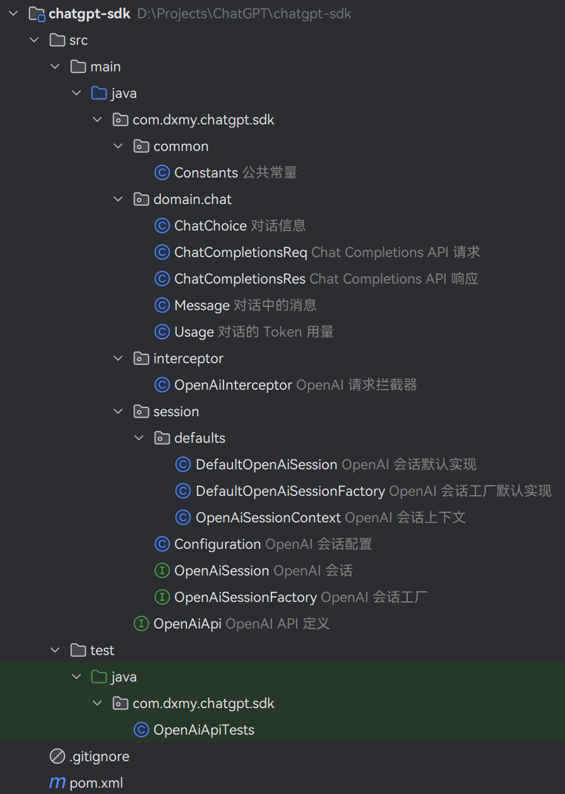
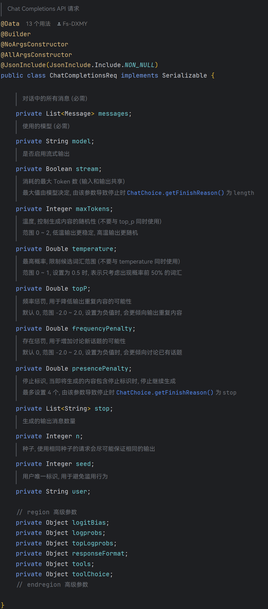
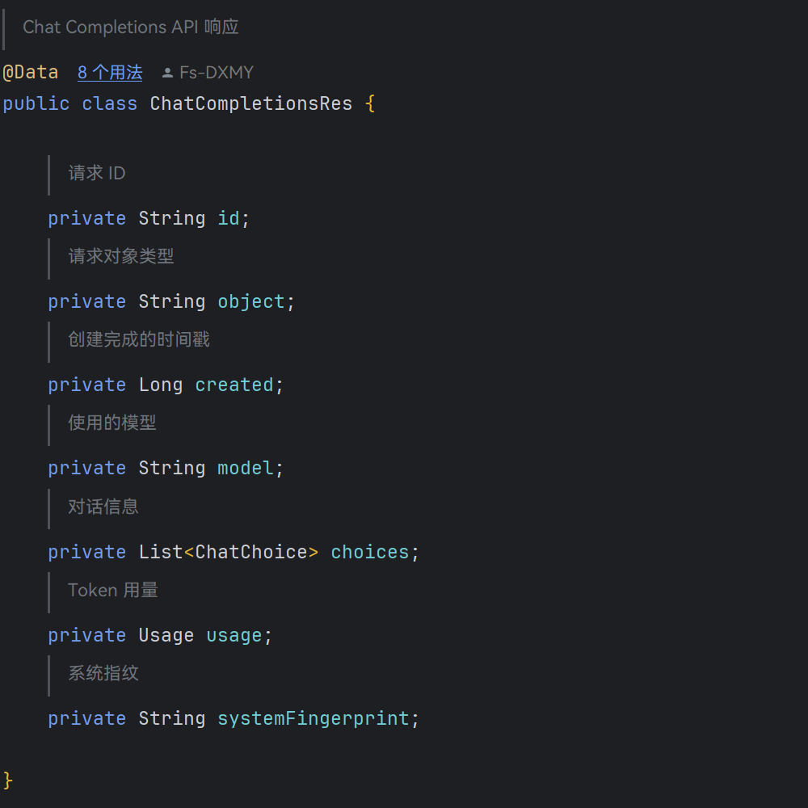

# OpenAI 项目学习笔记 - 第 8 节

项目结构:



- 把 `Model` 放在了 `Constants` 里, 都是和 Chat 相关的

```java
/**
 * 公共常量
 */
public class Constants {

    /**
     * ChatGPT 可调用模型版本
     */
    @Getter
    @AllArgsConstructor
    public enum Model {
        GPT_3_5_TURBO("gpt-3.5-turbo-1106"),
        GPT_3_5_TURBO_16K("gpt-3.5-turbo-16k"),
        GPT_4("gpt-4"),
        GPT_4_32K("gpt-4-32k");

        private final String model;
    }

    /**
     * Chat Completions API 中为消息设定的角色
     */
    @Getter
    @AllArgsConstructor
    public enum Role {
        /**
         * 系统消息, 通常位于消息数组的开始, 可为 AI 提供行为指示
         */
        SYSTEM("system"),
        /**
         * 用户消息, 通常是用户的输入
         */
        USER("user"),
        /**
         * AI 消息, 通常是 AI 的回复
         */
        ASSISTANT("assistant");

        private final String role;
    }

}
```

- 翻了半天官方文档, 整理了一下参数的作用 (下面的高级参数是我还没研究的, 有懂的可以交流一下)





> 类中都没有写 `@JsonProperty` 注解, 比较省事美观, 创建 OkHttp 客户端的时候选用自己定义的 `ObjectMapper`
>
> ```java
>     /**
>      * 初始化 OkHttp 客户端
>      */
>     private OkHttpClient initOkHttpClient(String apiKey) {
>         // 配置日志拦截器
>         HttpLoggingInterceptor httpLoggingInterceptor = new HttpLoggingInterceptor();
>         httpLoggingInterceptor.setLevel(HttpLoggingInterceptor.Level.BODY);
> 
>         return new OkHttpClient
>                 .Builder()
>                 .addInterceptor(httpLoggingInterceptor)
>                 .addInterceptor(new OpenAiInterceptor(apiKey))
>                 .connectTimeout(60, TimeUnit.SECONDS)
>                 .writeTimeout(60, TimeUnit.SECONDS)
>                 .readTimeout(60, TimeUnit.SECONDS)
>                 .build();
>     }
> 
>     /**
>      * 初始化 ObjectMapper
>      */
>     private ObjectMapper initObjectMapper() {
>         return new ObjectMapper()
>                 .setPropertyNamingStrategy(PropertyNamingStrategy.SNAKE_CASE)
>                 .configure(DeserializationFeature.FAIL_ON_UNKNOWN_PROPERTIES, false);
>     }
> ```