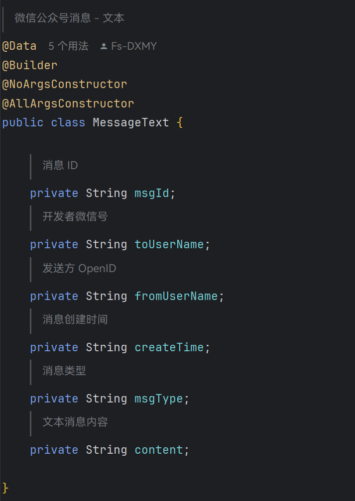
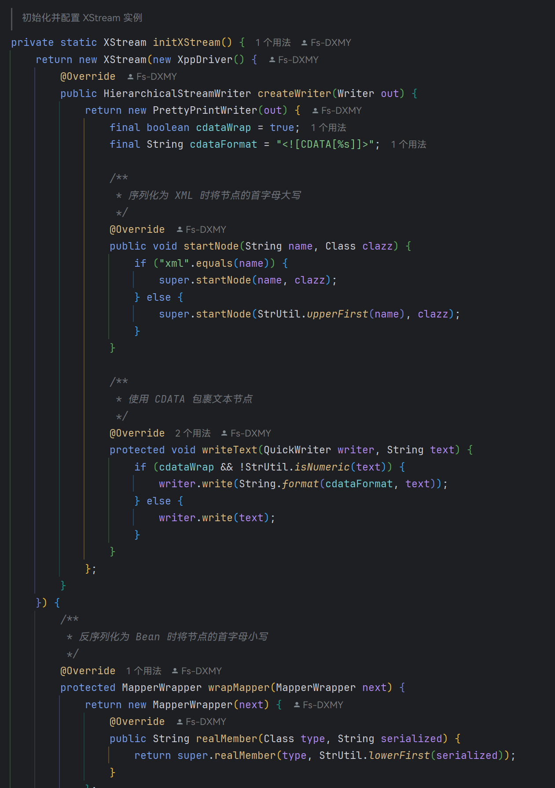
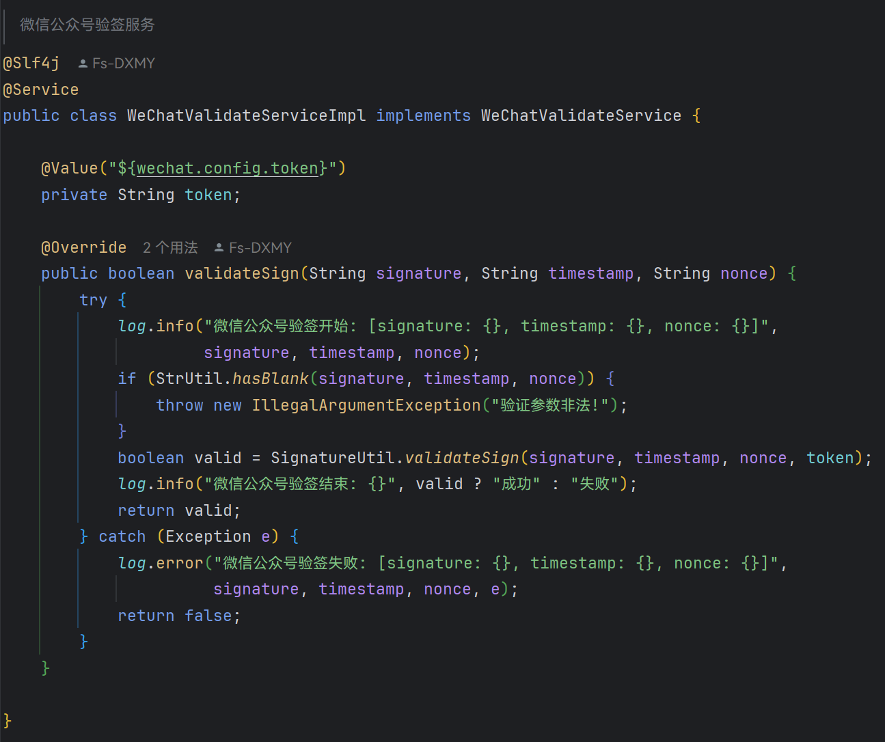
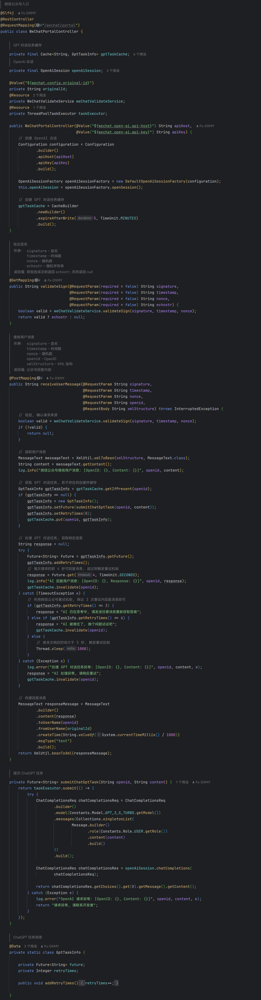

# OpenAI 项目学习笔记 - 第 9 节

- 微信公众号消息, 这里我没有使用 `@XStreamAlias` 注解

- 而是专门配置了一下 XStream, 让其专门处理微信的消息

- 微信公众号签名工具类, 这里用 Hutool 简化了 sha1 加密操作

- 验签服务实现类, 因为微信验证服务器和接收用户消息时都需要验签, 所有把日志也抽取到这里了

- WeChatPortalController
    - 微信公众号重试机制
        - 请求需要 5 秒内回复, 超时则触发重试
        - 5 秒内回复任意值都不会触发重试, 包括 `""` 和 `null`
        - 最多重试到第 3 次
    - 我这里的处理逻辑
        - 每次请求的前 4 秒可以返回 GPT 的消息
        - 若 4 秒内 GPT 未回复完成, 则触发 `TimeoutException` 异常
            - 如果重试次数没到第 3 次, 就手动延迟 1 秒, 使得响应时间超过 5 秒, 触发重试机制
            - 重试次数到第 3 次, 此时仍然没回复, 先返回 `AI 仍在思考中, 请发送任意消息重新获取答案`
            - 用户发送任意消息, 又重试了 3 次, 此时到第 6 次, 还没响应就可能遇到了 bug, 让用户换个问题
        - 综上, 用户发送消息后的 14 秒内 (两次重试 + 第三次的前 4 秒), 只要 AI 回答完了都可以正常回复, 否则就先返回 `AI 仍在思考中, 请发送任意消息重新获取答案`
        - 如果用户此时不再发送第二次消息, 该 GPT 对话会在 5 分钟后过期, 此处用的 Guava 的 Cache 实现

