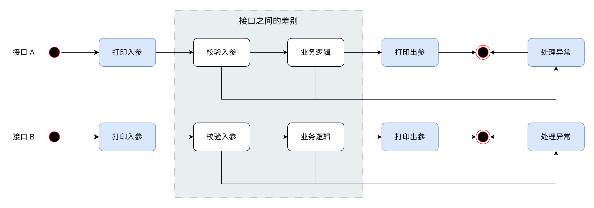
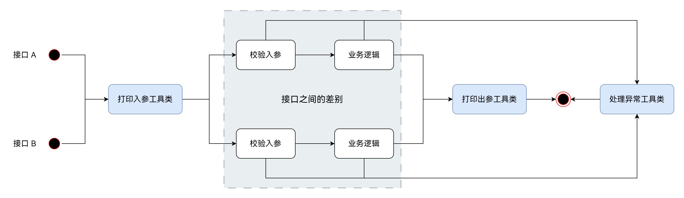
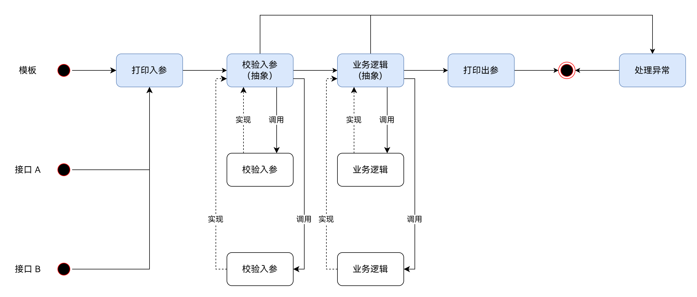

# 「搭系统先搭架子」

## 『背景』

项目没有规划好框架时，相同功能的代码**没有复用**，如打印日志、参数校验、异常处理等



缺陷：

- 现有逻辑无法复用，导致相同功能的**重复实现**
- 当通用的需求变动时，容易对现有代码**漏改、错改**等

## 『解决思路』

### 1. 抽取工具类

将相同功能的代码抽取成工具类，开发时**手动调用**工具类实现复用



缺陷：

- 无法保证后续的开发**能正确的使用**工具类
- 没有明确后续的开发**需要使用哪些**工具类

### 2. 模板方法

使用模板方法设计模式，提前规定执行的整个流程，接口之间的差别只需实现该环节对应的抽象方法



特点：

- 必要的环节**一定会被调用**
- 调用方法的**顺序一定正确**
- 开发时**无需关注通用逻辑**
- 通用逻辑**易于变更和升级**

具体到模板实现：

```java
@Slf4j
public abstract class ServiceTemplate<T, R> {

    /**
     * 模板入口方法
     */
    public R doProcess(T request) {
        // 打印入口日志
        log.info("start invoke, request: " + request);
        // 开始计时
        StopWatch stopWatch = new StopWatch();
        stopWatch.start();

        try {
            // 校验参数
            validateParam(request);
            // 执行业务逻辑
            R response = process(request);
            // 结束计时
            stopWatch.stop();
            long costTime = stopWatch.getTotalTimeMillis();
            // 打印出口日志
            log.info("end invoke, response: {}, costTime: {}", response, costTime);
            return response;
        } catch (Exception e) {
            // 打印异常日志
            log.error("error invoke, exception: ", e);
            return null;
        }
    }

    /**
     * 校验参数
     */
    protected abstract void validateParam(T request);

    /**
     * 执行业务逻辑
     */
    protected abstract R process(T request);
}
```

具体到业务代码实现：

```java
public UserVO getUserInfo(String userId) {
    return (new ServiceTemplate<String, UserVO>() {
        @Override
        protected void validateParam(String request) {
            // 校验参数
        }

        @Override
        protected UserVO process(String request) {
            // 执行业务逻辑
            return null;
        }
    }).doProcess(userId);
}
```

在项目实践中，打印日志可以通过 AOP 或者拦截器实现、异常处理可以通过全局异常处理器实现

## 『引申问题』

虽然现在相同功能的代码实现了复用，但现在的业务逻辑全部放在了一个“大而全”的方法内，依然有很多问题：

- **方法难以理解**，业务逻辑的代码臃肿，看懂具体实现非常依赖注释的质量
- **代码难以变动**，增加需求或更改需求时，变动的代码容易对周围的代码产生影响
- **单元测试难以进行**，业务逻辑复杂后，需要大量的 mock 数据，也容易忽略部分分支
- 业务代码也会出现**重复实现问题**，导致需求变动时代码的**漏改、错改**等

> 上面的现象用一个词概括，就是**耦合**
